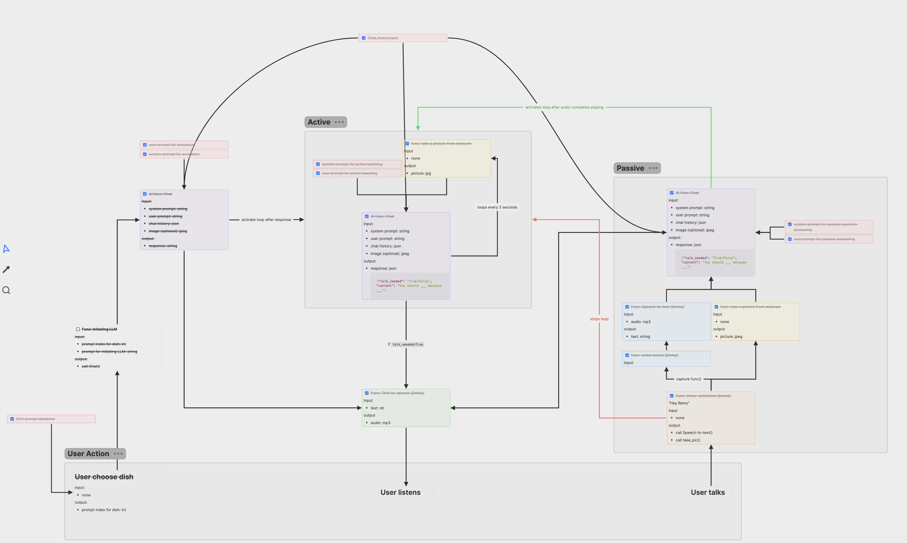
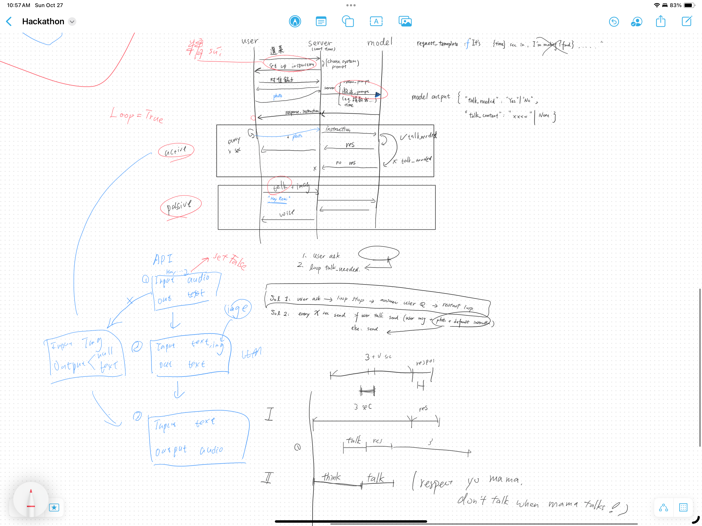

# Remy AI Assistant

This project implements an AI assistant named Remy, capable of processing images, engaging in conversations, and responding to voice commands.

## Thought Processes
API Doc

Thought Process



## Installation

1. Ensure you have Python 3.8+ installed.

2. Install `uv` if you haven't already:
   ```
   pip install uv   ```

3. Clone the repository and navigate to the project directory.

4. Create a virtual environment and install dependencies:
   ```
   uv venv
   source .venv/bin/activate  # On Windows, use: .venv\Scripts\activate
   uv pip install -r requirements.txt   ```

5. Set up environment variables:
   - Create a `.env` file in the project root.
   - Add your API keys:     ```
     OPENAI_API_KEY=your_openai_api_key
     ZHIPU_API_KEY=your_zhipu_api_key
     PORCUPINE_ACCESS_KEY=your_porcupine_access_key     ```

## Main Components

### `main.py`

This file contains the FastAPI backend for the Remy AI assistant. Key functions include:

- `chat_internal`: Processes chat messages with optional image input, maintains chat history, and interacts with the AI model.
- `process_image`: Handles image uploads and processing.
- `active_chat`: Endpoint for initiating chat sessions with the AI.

### `test.py`

This file implements the voice interaction and continuous monitoring features. Main functions include:

- `listen_for_hotword`: Continuously listens for the wake word "Hey Remy".
- `recognize_speech`: Captures and processes voice commands after wake word detection.
- `repeating_task`: Periodically captures images and initiates conversations with the AI.
- `on_wake_word_detected`: Handles the wake word detection event, pausing the repeating task and initiating speech recognition.

### `hey_remy.py`

This file implements the wake word detection functionality using Porcupine. Key features include:

- `init_porcupine`: Initializes the Porcupine wake word detection engine
- `recognize_speech`: Captures and processes voice input after wake word detection
- `listen_for_hotword`: Continuously monitors audio input for the wake word "Hey Remy"
- `on_wake_word_detected`: Handles wake word detection by triggering speech recognition


### prompts.yaml

This file contains the prompts for the AI assistant. You can modify them to change the assistant's behavior.

## Running the Program

To run the program, use:

```
python test.py
```

The assistant will now be ready to:
- Listen for the wake word "Hey Remy"
- Process voice commands
- Analyze images and provide cooking guidance
- Maintain conversational context
